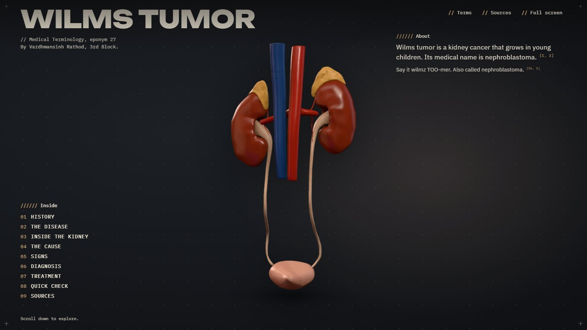
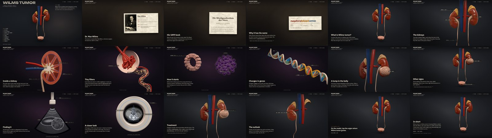
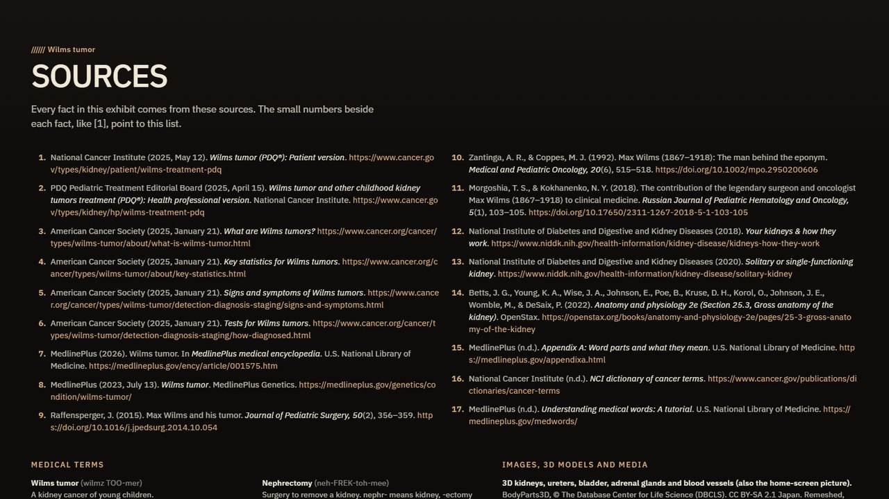

# Wilms Tumor, an interactive 3D exhibit

**Medical Terminology · Eponym #27 · Vardhmansinh Rathod · 3rd Block**

One continuous page. Scrolling is a camera zoom: from Max Wilms and his 1899 book, into the
urinary system, inside a kidney, down to its tiny filters and the young cells where the tumor
starts, then back out to the lump, the other signs, the scans, the operation and the outlook,
ending with a short self-check and the sources.







---

## Before you submit

Your name and class are set in [`src/app/config.ts`](src/app/config.ts):

```ts
studentName: 'Vardhmansinh Rathod',
classPeriod: '3rd Block',   // shown on the home screen, the summary and the list of sources
```

Nothing else needs editing.

## Presenting it (smart board, projector or laptop)

The exhibit is one scene, not slides. There are no arrows, Next buttons or page numbers: you move by
zooming, and the words for each part appear quietly in the corner.

1. Open the link on the board in Chrome or Edge and tap **Full screen** in the top-right corner (or
   press **F**). Text grows with the screen, so it stays readable from the back of the room.
2. **Swipe up** on the board to zoom on to the next part, **swipe down** to go back. A clicker, the
   arrow keys, Page Down or a mouse wheel do the same. It always comes to rest on the next part.
3. At each part, read the heading and explain it in your own words. The presenter guide has a line
   to say for every part.

| Do this | To |
| --- | --- |
| Swipe up, clicker, **→ / ↓ / Page Down / Space**, mouse wheel | zoom on to the next part |
| Swipe down, **← / ↑ / Page Up** | go back |
| Tap a part in the home screen list | jump straight there |
| **F** or **Full screen** | full screen on or off |
| **Home / End** | back to the start, or the summary |
| Drag the 3D picture | turn it (double-tap or **R** resets it) |
| Tap an underlined word | its meaning, pronunciation and word parts |
| Tap a small source number | the source behind that fact |

After the summary, one more swipe scrolls into the full list of sources, the medical terms and the
image credits.

### Presenter guide (printable)

Open the exhibit’s address with **`?guide`** on the end (e.g. `…vercel.app/?guide`) for a printable
five-minute plan: what to say and what to tap at each part, the medical terms with pronunciation,
likely questions with answers from the sources, and the quiz answers. There is also a link at the
very end of the exhibit.

**On a slower computer** (a smart board’s built-in computer): add `?lite` to the address, e.g.
`…vercel.app/?lite`. Nothing is removed or simplified. Lite draws at the screen’s own resolution
instead of above it and paces the moving scenes at 30 frames a second. Weak devices switch to it by
themselves, and a device that starts lagging switches and remembers it. `?hq` forces full mode.

Tip: to open straight at a part, add `?stop=` to the address, e.g. `…/?stop=nephron`.

**Backup video.** If the classroom computer can’t run 3D, `node scripts/record-tour.mjs tour.mp4`
records the whole zoom as an MP4 (needs ffmpeg). Without WebGL the page itself still works, with
still pictures instead of 3D.

## Assignment checklist (from the project handout)

**Required content**

| The handout asks for | Where it is in the exhibit |
| --- | --- |
| Correct name and spelling, and the modern term | Home screen: **Wilms Tumor**, “Also called nephroblastoma”, and how to say it |
| Origin: the person it is named for | Part 2: profile card of **Max Wilms** (1867 to 1918), a German surgeon |
| Brief historical profile and why the name stuck | Parts 2 to 4: his life in four dates, his 1899 book *The Mixed Tumors of the Kidney*, and why the tumor carries his name |
| A clear definition in your own words | Home screen and part 5, “What is Wilms tumor?” |
| Body system or medical specialty | Part 5: a cancer of the kidney, part of the urinary system (the guide adds pediatric oncology) |
| At least four clinical facts | The cause (young cells, gene changes), the signs (a lump, blood in the urine), how doctors find it (ultrasound, CT or MRI) and the treatment (nephrectomy, chemotherapy, radiation), plus the outlook |
| At least three terms, word parts, abbreviations or pronunciation tips | Explained in plain words on screen (“Nephr means kidney, blast means bud and oma means tumor”), 14 terms with pronunciation in the **Terms** panel and at the end, the abbreviation CT |
| At least two visuals with captions or labels | Labeled 3D scenes: the urinary system, the tumor, a kidney cut in half, a nephron, young cells, DNA, an ultrasound and a CT scanner; the captioned portrait |
| Purposeful interactive elements | The list of parts, the + marker, organs you can tap, term pop-ups, source numbers, the 3D model you can turn, the quiz |
| Source numbers that connect to the reference list | Every fact has a small source number; the full list is at the end |

**Design, research and presenting**

| The handout asks for | Where it is |
| --- | --- |
| Clear title, consistent colors and fonts, readable text, logical sections | Parts: History, The disease, Inside the kidney, The cause, Signs, Diagnosis, Treatment, Quick check, Sources; one warm palette; IBM Plex Sans for reading |
| A home screen that introduces the eponym and guides the viewer | Home screen with the definition and a list of the parts that jumps to each one |
| At least three interaction types | Navigation (the list of parts, swiping and scrolling), hotspots (+ marker, tappable organs, labels, term pop-ups), and the self-check quiz, plus the 3D model you can turn |
| School-appropriate visuals, patient privacy | No patient photos; the scans are drawings; the portrait is openly licensed (CC BY 4.0) |
| At least three credible sources (not Wikipedia or AI) | 17: National Cancer Institute, American Cancer Society, MedlinePlus (NIH), NIDDK (NIH), OpenStax, and three peer-reviewed history articles |
| Paraphrased, numbered citations and a full APA reference page | Yes, the reference page is the end of the exhibit (and [SOURCES.md](SOURCES.md)) |
| Cite all media you did not create | “Images, 3D models and media” at the end, and [CREDITS.md](CREDITS.md) |
| 3 to 5 minute presentation that explains the organization and features | The presenter guide (`?guide`) is paced for about 5 minutes and starts with the list of parts |

**Submission checklist**

- [ ] Shareable link that opens without requesting access: test the link in a private window
- [x] Only the assigned eponym, with all required content
- [x] All interactive features work (checked by the browser tests)
- [x] Reference page included (end of the exhibit)
- [x] Student name and class period: “Vardhmansinh Rathod, 3rd Block” on the home screen, in the corner of every part, and at the end
- [ ] Proofread and practiced: use the presenter guide

## Running it

Requires Node.js 20.19+ (tested on Node 24).

```bash
npm install
```

```bash
npm run dev
```

Opens a local server with hot reload (Vite). Other scripts:

| Command | What it does |
| --- | --- |
| `npm run build` | type-check and build the static site into `dist/` |
| `npm run preview` | serve the built site at http://localhost:4173 |
| `npm test` | unit tests (Vitest): story order, caption length, plain wording (no em dashes), presenter scripts, terms, facts, sources, quiz, zoom logic, camera poses |
| `npm run test:e2e` | browser tests (Playwright): home screen and its list of parts, full clicker walk, smart-board swiping and text size, no slide buttons, sources page, presenter guide, kidney marker, quiz on the 3D model, overlays, reduced motion, lite mode, no-WebGL fallback, 1366×768 and 1920×1080 |
| `npm run lint` | oxlint |

First time running the browser tests: `npx playwright install chromium`.

## Deploying (Vercel)

Vercel builds and publishes every push to `main`. For a new copy: on vercel.com choose
**Add New → Project**, pick this repository, keep the detected **Vite** preset (build
`npm run build`, output `dist`) and deploy. Any static host works the same way: upload the contents
of `dist/`.

## How it works

- **One page, one number.** The page is 18 screens tall. The scroll position becomes a single
  continuous value `t` (stop 3.5 = halfway between stops 3 and 4) that follows the scroll with a
  little damping. Everything (camera, captions, the history cards, the tumor growing, the kidney
  being taken out) is a pure function of `t`, so it can be scrubbed forwards and backwards
  ([`src/app/journey.ts`](src/app/journey.ts)).
- **The zoom-through.** Within a scene the camera glides. Between scenes it accelerates into a
  surface while that surface’s colour grows from the middle of the screen, then the next scene opens
  up through a hole in the middle and comes towards the camera, like flying out of a tunnel.
  Zooming back out plays the same thing in reverse. ([`src/three/presets.ts`](src/three/presets.ts),
  [`src/three/Director.tsx`](src/three/Director.tsx), `ZoomVeil` in [`src/app/App.tsx`](src/app/App.tsx))
- **History to 3D.** The urinary model first appears as an engraved plate on paper, then a sweep
  “develops” it into the full-colour model.
- **3D.** three.js through React Three Fiber. The urinary organs come from BodyParts3D, cleaned up
  in Blender (holes filled, remeshed, smoothed, decimated, ambient occlusion baked) and compressed
  with meshopt (0.3 MB). The tumor, the cut-open kidney, the nephron, the cells, the DNA and the two
  scans are made in code.

**Type:** in the style of igloo.inc: IBM Plex Mono for small labels and links (“//” and “//////”),
IBM Plex Sans for everything people read, and Unbounded for the title like a logo. Headings decode
into place. The warm colours are this exhibit’s own.

**Performance:** the 3D code loads in the background while the home screen is up; each 3D world is
mounted and its shaders compiled ahead of time; frames render only while something moves; every
view draws fewer than 70,000 triangles in at most 10 draw calls; resolution adapts to the device;
set-ups the camera is not looking at are not drawn at all; low-end devices get the same scenes in
“lite” mode (see *Presenting it*).
**Accessibility:** full keyboard and clicker control, visible focus, captions announced to screen
readers, `prefers-reduced-motion` (jumps instead of flying), and a still-image version with all the
text, quiz and sources when WebGL is unavailable.

## Project layout

```
src/
  app/        journey (scroll → t), store (state), config (name/period), App
  content/    story stops, sources, glossary, quiz
  three/      Stage, Director (camera), presets (poses), anatomy/ kidney/ nephron/ cells/ diagnosis/ worlds
  ui/         captions, history layer, HUD, quiz, overlays, references, term pop-over
  styles/     app.css
public/       model (.glb), home-screen picture, portrait, textures, fallback stills
e2e/          Playwright tests
scripts/      model processing (Blender) and screenshot helpers
```

## License notes

- **Code:** MIT, see [LICENSE](LICENSE).
- **3D urinary model:** modified from BodyParts3D © DBCLS, licensed **CC BY-SA 2.1 Japan**; the
  modified model in `public/models/` is shared under the same license (see `public/models/LICENSE.txt`).
- **Portrait of Max Wilms:** Wellcome Collection, **CC BY 4.0**.
- **Fonts:** SIL Open Font License 1.1.

Full details in [CREDITS.md](CREDITS.md) and [SOURCES.md](SOURCES.md). This exhibit is for education
and is not medical advice.
